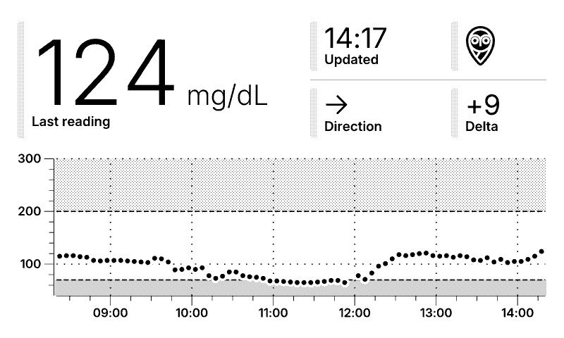

# TRMNL Nightscout

TRMNL Nightscout fetches blood sugar data from [Nightscout](https://github.com/nightscout/cgm-remote-monitor) and renders an image intended to be displayed using the [Redirect plugin](https://help.usetrmnl.com/en/articles/11035846-redirect-plugin) on a [TRMNL](https://usetrmnl.com) device. The server periodically fetches readings from a Nightscout instance, generates a graph along with the latest glucose value and direction, then exposes the result as a PNG image.

## Features
- Render latest blood sugar, direction, delta, and a graph to a TRMNL device.
- Updated as soon as a new reading is available, typically every 5 minutes.
- Invert colors when too low or high.
- Supports mg/dL and mmol/L.
- Require an access token to protect your data.
- Customize the time format and graph parameters.

<p align="center">
  <picture>
    <source media="(prefers-color-scheme: dark)" srcset="assets/preview_dark.png">
    
  </picture>
</p>

## Usage

TRMNL Nightscout is configured entirely via environment variables. The most important settings are the Nightscout URL and token. See [config.md](config.md) for the full list of options. A minimal example:

```bash
docker run -d \
  -e NIGHTSCOUT_URL="https://my-nightscout-url" \
  -e IMAGE_URL="http://my-trmnl-nightscout-host-port"
  -p 8080:8080 \
  ghcr.io/gabe565/trmnl-nightscout
```

Once running, the JSON endpoint at `/` must be publicly available. TRMNL's Redirect plugin will use this endpoint to get the image URL and to check if a new image is available.

The image endpoint is `/image.png` and does not need to be publicly available. `IMAGE_URL` must be set to a URL that the TRMNL device can use to connect to trmnl-nightscout. It can be a public URL or an internal IP address as long as the TRMNL device is on the same network.

Once this app is running, configure the TRMNL Redirect plugin with the Web Address set to your public JSON endpoint. If you opt to set an `ACCESS_TOKEN`, add this to the TRMNL Redirect URL as a `token` query parameter.  
For example, you could set the TRMNL Web Address to `https://my-trmnl-nightscout.example.com/?token=my-token`.
